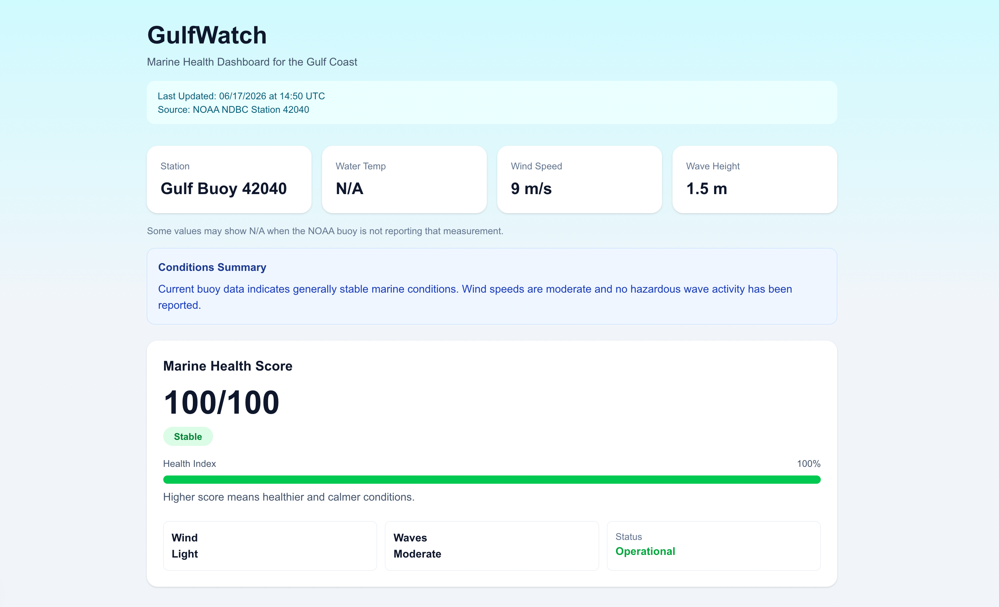

# 🌊 GulfWatch

A real-time marine monitoring dashboard that visualizes Gulf Coast buoy data from NOAA and calculates an overall Marine Health Score.



---

## Overview

GulfWatch retrieves live environmental data from NOAA buoy stations and transforms raw measurements into an easy-to-understand dashboard for monitoring marine conditions.

The application evaluates factors such as wind speed, wave height, and water conditions to generate a Marine Health Score that helps users quickly assess environmental stability.

---

## Features

- 📡 Live NOAA buoy data integration
- 🌊 Marine Health Score (0–100)
- 📈 Dynamic health index visualization
- 🚦 Condition status indicators
- 💨 Wind condition analysis
- 🌊 Wave condition analysis
- 📝 Automated conditions summary
- 🕒 Last updated timestamp
- 📱 Responsive dashboard design

---

## Technologies Used

- Next.js
- React
- TypeScript
- Tailwind CSS
- NOAA National Data Buoy Center (NDBC)

---

## Data Source

GulfWatch uses publicly available environmental data from the NOAA National Data Buoy Center (NDBC).

Current monitored station:

- NOAA Station 42040
- Gulf of Mexico

NOAA NDBC: https://www.ndbc.noaa.gov/

---

## Scoring System

The Marine Health Score is calculated using environmental conditions reported by NOAA buoys.

| Score Range | Condition |
|------------|------------|
| 85–100 | Stable |
| 65–84 | Caution |
| 0–64 | Risk |

Higher scores indicate calmer and healthier marine conditions.

---

## Installation

Clone the repository:

```bash
git clone https://github.com/MylesGuidry/gulfwatch.git
```

Navigate into the project:

```bash
cd gulfwatch
```

Install dependencies:

```bash
npm install
```

Run the development server:

```bash
npm run dev
```

Open:

```text
http://localhost:3000
```

---

## Project Structure

```text
gulfwatch/
├── app/
│   ├── page.tsx
│   └── layout.tsx
│
├── lib/
│   ├── noaa.ts
│   └── score.ts
│
├── public/
│   └── dashboard.png
│
└── README.md
```

---

## Future Enhancements

- Support for multiple NOAA buoy stations
- Historical marine condition tracking
- Interactive trend charts
- Regional Gulf Coast comparisons
- Map-based buoy visualization
- Weather overlays
- Mobile-first dashboard design

---

## Why I Built This

I created GulfWatch as a personal project to practice working with real-world APIs, environmental datasets, and dashboard design.

The project demonstrates:

- API integration
- Data parsing and processing
- TypeScript development
- React/Next.js application design
- Data visualization
- Responsive UI development

---

## Author

**Myles Guidry**

Computer Science Student  
Louisiana State University

Interested in software engineering, data visualization, aerospace technology, environmental monitoring systems, and public-sector technology solutions.
